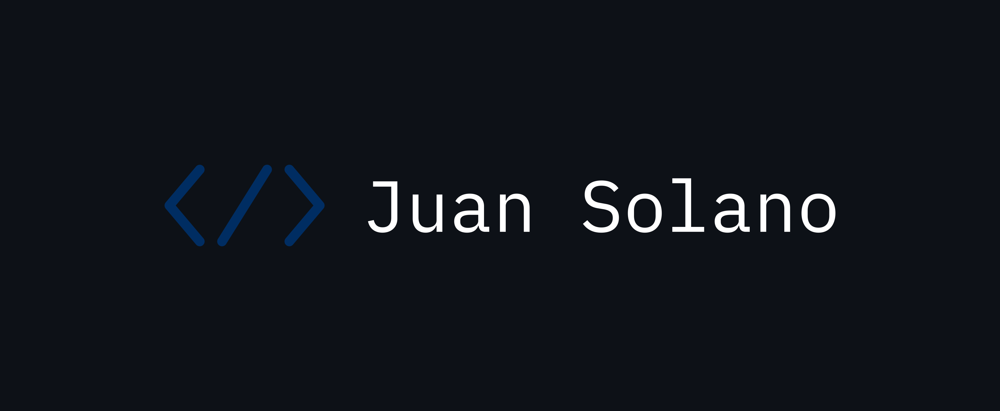
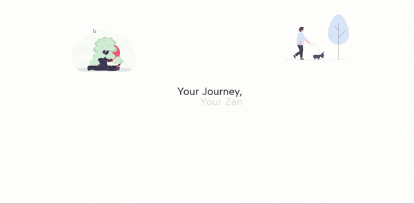
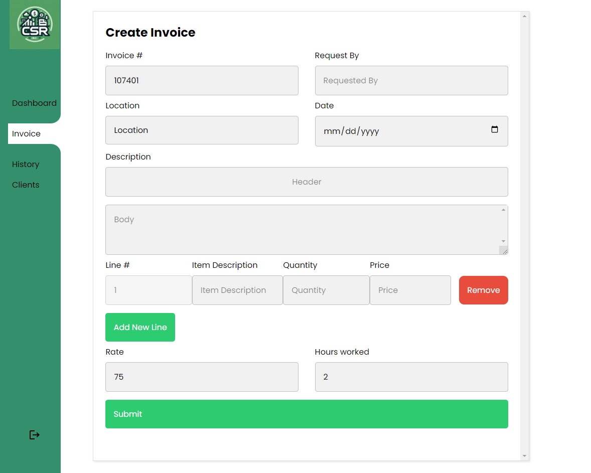
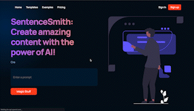

 

### 
 Hi, I’m Juan 👋🏽 
Full-Stack JavaScript Dev

 

  
  

 

A creative and detail-oriented, software engineer with a deep interest in narrow applications of AI.

### 
Check out <a href="https://juansolano.netlify.app/" target="_blank">my portfolio site</a> for more information!

 

---

 

<!-- PROJECTS -->
<h2 align="center" color="white">Projects</h2>

	<table>
		<tr>
		<!-- project 1  -->
			<td width="50%">
				<h3 align="center" color="white">Zentor - Your Journey, Your Zen</h2>
				
 
					
					 
					 
					

						<!--repo-->
						  
						<!--live site-->
							
					

					
<strong>Built with Next.js & (GPT-4 + Open Source) & RAG (Retrieval-Augmented Generation) technologies.</strong>

				

			</td>
		<!-- project 2 -->
			<td width="50%">
				<h3 align="center" color="white">OCR-PDF - Open Source Invoice Processing</h2>
				
 
					
					 
					 
					

                        			<!--repo -->
						  
                        			<!--live site -->
							
					

					
<strong>React, Express, MongoDB, Node</strong> - Create amazing content with the power of AI!

				

			</td>
		</tr>
		<tr>
		<!-- project 3 -->
			<td width="50%">
				<h3 align="center" color="white">SentenceSmith</h2>
				
 
					
					 
					 
					

                        			<!--repo -->
						  
                        			<!--live site -->
							
					

					
<strong>React, Express, MongoDB, Node</strong> - Create amazing content with the power of AI!

				

			</td>
			<!-- project 4  -->
			<td width="50%">
				<h3 align="center" color="white">Filmo - Build a better watchlist</h2>
				
 
					
					 
					 
					

						<!--repo-->
						  
						<!--live site-->
							
					

					
<strong>Built with Node, Express, MovieDB API, MongoDB, and EJS.</strong>

				

			</td>
		</tr>
	</table>

 

---

 

## My Skill Set

<table><tr><td valign="top" width="50%">

### Frontend

  
  
  
  
  
  

</td><td valign="top" width="50%">

### Backend

  
  
  
  

  

</td></tr></table>

 

## Connect with me

  
  

